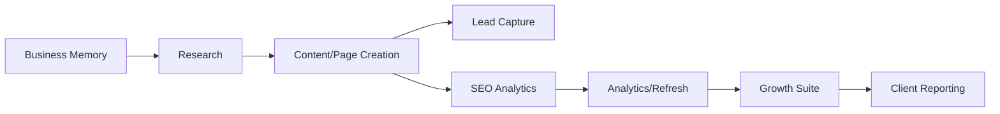

# Detailed Agent Catalog

This document explains every agent in the Marketing Agent system, why it exists, what it reads, what it writes, and what external services it uses.

## Agent Map



## 1. Business Memory Agent

Code:

```text
app/agents/business_memory.py
```

Purpose:

- stores the business profile;
- keeps business context reusable for campaigns and content generation;
- makes the system understand the company before generating marketing output.

Inputs:

- business name;
- website;
- industry;
- audience;
- value proposition;
- offers;
- competitors;
- tone.

Writes:

- `business_profiles`;
- `campaigns`;
- `audit_events`.

Why it matters:

Without a durable business memory, every campaign would behave like a fresh prompt. This agent makes the system reusable for each client.

## 2. Research Agent

Code:

```text
app/agents/research.py
```

Purpose:

- finds buyer-intent topics;
- creates demand signals;
- maps campaign goals into search-oriented opportunities.

Inputs:

- business profile;
- campaign goal;
- target region;
- competitors;
- offers.

Writes:

- `demand_signals`.

External services:

- OpenAI when configured;
- deterministic fallback when OpenAI is unavailable.

Output examples:

- keyword/topic;
- intent;
- region;
- priority score;
- rationale.

## 3. Content/Page Creation Agent

Code:

```text
app/agents/content.py
```

Purpose:

- converts demand signals into public landing pages;
- creates SEO metadata, hero copy, sections, and CTAs.

Inputs:

- business profile;
- campaign;
- demand signal.

Writes:

- `landing_pages`.

External services:

- OpenAI when configured;
- deterministic fallback when OpenAI is unavailable.

What it creates:

- slug;
- title;
- hero;
- structured page sections;
- CTA;
- SEO metadata;
- brand theme.

## 4. Lead Capture Agent

Code:

```text
app/agents/lead_capture.py
```

Purpose:

- captures inbound leads from landing pages;
- scores leads;
- ties leads back to page and campaign.

Inputs:

- name;
- email;
- company;
- message;
- campaign ID;
- page ID.

Writes:

- `leads`;
- page conversion counters.

Scoring behavior:

- higher score for business email;
- higher score when company/message are provided;
- status can become `qualified` when score passes threshold.

## 5. SEO Analytics Agent

Code:

```text
app/agents/seo_analytics.py
```

Purpose:

- combines Google Search Console, GA4, first-party events, leads, and page data;
- calculates page health;
- powers the SEO Analytics screen.

Inputs:

- landing pages;
- leads;
- first-party page events;
- Search Console metrics;
- GA4 metrics.

Writes:

- `seo_integration_connections`;
- `seo_search_metrics`;
- `analytics_page_metrics`;
- `seo_recommendation_runs`;
- `page_events`.

External services:

- Google Search Console API;
- Google Analytics Data API.

Metrics:

- impressions;
- clicks;
- CTR;
- average position;
- sessions;
- engaged sessions;
- leads;
- conversion rate;
- page health score.

## 6. Analytics/Refresh Agent

Code:

```text
app/agents/analytics_refresh.py
```

Purpose:

- reviews page performance;
- creates refresh recommendations;
- tells the owner what should be improved.

Inputs:

- campaigns;
- pages;
- SEO overview;
- leads;
- page metrics.

Writes:

- `refresh_recommendations`.

Typical recommendations:

- improve keyword targeting;
- add internal links;
- strengthen content depth;
- revise CTA;
- create similar pages for winning topics;
- wait for more data when Google has not processed enough rows.

## 7. AI Search Visibility Agent

Code:

```text
app/agents/growth_suite.py
```

Purpose:

- evaluates whether brands and pages are likely to be visible in ChatGPT/OpenAI-style answer journeys;
- currently scoped to OpenAI/ChatGPT only.

External services:

- OpenAI.

Output:

- visibility score;
- tracked brands;
- content pages reviewed;
- recommended content actions;
- authority gaps.

Important:

This does not guarantee that ChatGPT will cite the brand. It improves the content and authority signals that make citation more likely.

## 8. Backlink / Authority Agent

Code:

```text
app/agents/growth_suite.py
app/integrations/dataforseo.py
```

Purpose:

- evaluates domain authority and backlink readiness;
- finds keyword and authority opportunities;
- supports SEO team replacement for authority research tasks.

External services:

- DataForSEO.

Inputs:

- business website;
- competitors;
- campaign goals;
- target region.

Output:

- backlinks;
- referring domains;
- authority score;
- spam score;
- keyword opportunities;
- priority scores.

Why it matters:

Google ranking depends heavily on authority and trust signals. Content alone is often not enough. Backlink and authority analysis helps identify where the site needs stronger citations, references, partnerships, and external mentions.

## 9. Auto Refresh + Approval Agent

Code:

```text
app/agents/growth_suite.py
```

Purpose:

- turns page health problems into a refresh queue;
- keeps publishing under human review.

Inputs:

- SEO page health;
- Search Console performance;
- GA4 sessions;
- leads and conversion rates;
- current recommendations.

Output:

- weak pages;
- diagnosis;
- next action;
- approval policy.

Current policy:

```text
human_review_required
```

## 10. Paid Campaign Agent

Code:

```text
app/agents/growth_suite.py
app/integrations/google_ads.py
```

Purpose:

- connects organic SEO learnings to Google Ads readiness;
- reads Google Ads campaign reporting when API access is approved and credentials are valid;
- prepares paid campaign visibility for the Growth Suite.

External services:

- Google Ads API.

Inputs:

- campaigns;
- Google Ads OAuth refresh token;
- developer token;
- customer IDs.

Output:

- campaign count;
- impressions;
- clicks;
- cost;
- conversions;
- paid campaign status.

Important:

The current implementation reads and reports campaign data. Any automated spend or campaign launch should remain manually approved.

## 11. Client Reporting Agent

Code:

```text
app/agents/growth_suite.py
```

Purpose:

- packages the client-facing story;
- converts raw SEO/page/lead metrics into executive reporting.

Inputs:

- businesses;
- campaigns;
- published pages;
- leads;
- SEO metrics.

Output:

- client count;
- campaign count;
- published pages;
- organic clicks;
- sessions;
- leads;
- report recommendations.

## 12. Client Workspace / Access Control Agent

Code:

```text
app/agents/growth_suite.py
```

Purpose:

- separates data by business/client;
- supports client-specific demos and reporting.

Inputs:

- businesses;
- campaigns;
- pages;
- leads.

Output:

- client workspace list;
- business ID partitioning;
- governance score;
- recommended role-based access next step.

Current state:

- company-separated views exist;
- full authenticated client login should be added before giving direct client access.

