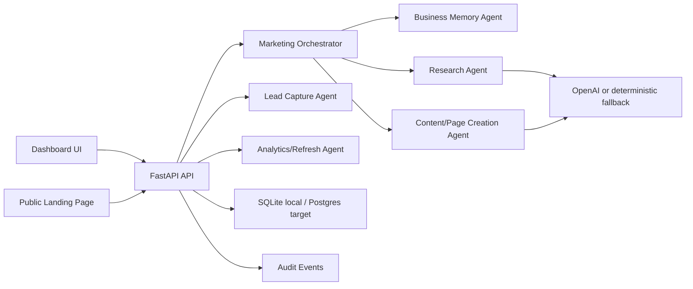
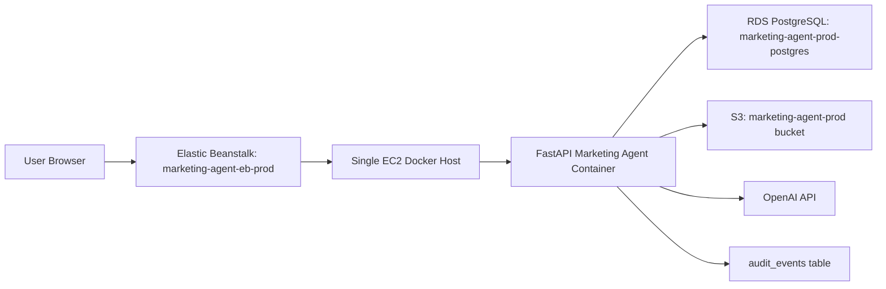

# Architecture

## High-Level Design

Marketing Agent is a single FastAPI service that serves both API endpoints and the static dashboard UI.



## Main Components

- `app/main.py`: FastAPI application factory, CORS setup, static file mounting, route registration.
- `app/api/routes.py`: API routes, public landing page rendering, dashboard summary, content repair.
- `app/agents/`: Agent implementations and orchestrator.
- `app/core/config.py`: Environment settings loaded from `.env`.
- `app/core/database.py`: SQLAlchemy engine, session, and table creation.
- `app/core/audit.py`: Audit event writer.
- `app/core/content_formatting.py`: Normalizes LLM output into human-readable page content.
- `app/models/entities.py`: SQLAlchemy database models.
- `app/models/schemas.py`: Pydantic request and response models.
- `app/static/`: Dashboard and public page frontend assets.
- `tests/`: API, agent-loop, and content-formatting tests.

## Runtime Flow

1. User creates a business profile from the dashboard.
2. User creates and launches a campaign.
3. `MarketingOrchestrator` runs:
   - Research Agent creates demand signals.
   - Content/Page Creation Agent creates landing pages.
   - Analytics/Refresh Agent creates first recommendations.
4. Pages are stored in the database and exposed through `/p/{slug}`.
5. Leads submitted through public pages are scored and stored.
6. Dashboard summarizes metrics and recent activity.

## Data Storage

Default local storage is SQLite:

```text
sqlite:///./data/marketing_agent.db
```

For production or multi-instance deployment, use RDS Postgres and set `DATABASE_URL` in `.env` or the cloud environment.

## LLM Behavior

OpenAI is used when `OPENAI_API_KEY` is configured and `OPENAI_ENABLED=true`.

If OpenAI is not configured or an LLM call fails, agents use deterministic fallback content. This keeps local development, testing, and demos stable.

## Production Notes

- The app creates tables automatically at startup.
- SQLite is acceptable for local use or a single EC2 instance with persistent EBS.
- RDS Postgres is recommended before autoscaling or multi-instance Elastic Beanstalk.
- `API_KEY` protects admin write endpoints when configured.
- `.env` is intentionally ignored by git and should contain local secrets only.

## Current AWS Runtime



Current public endpoint:

```text
http://marketing-agent-prod.ap-south-1.elasticbeanstalk.com
```

PostgreSQL operational queries are maintained in:

```text
docs/POSTGRES_QUERY_ARTIFACT.md
```
