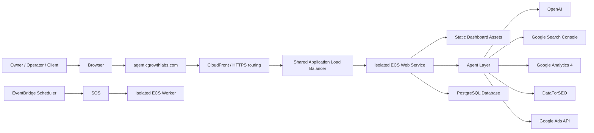
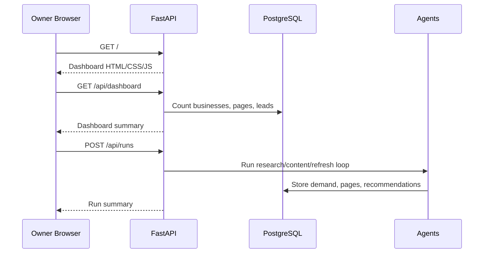
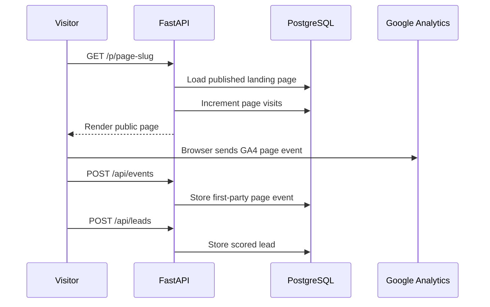
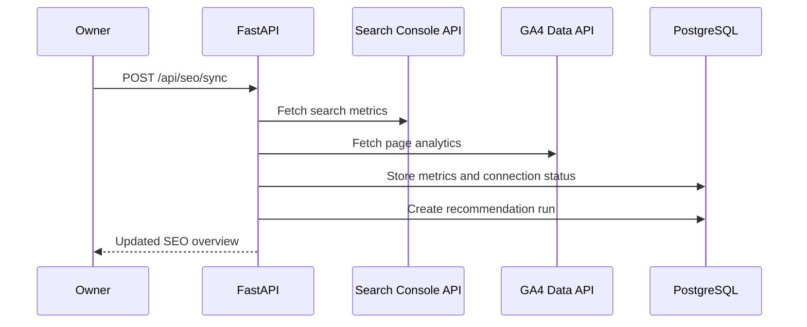
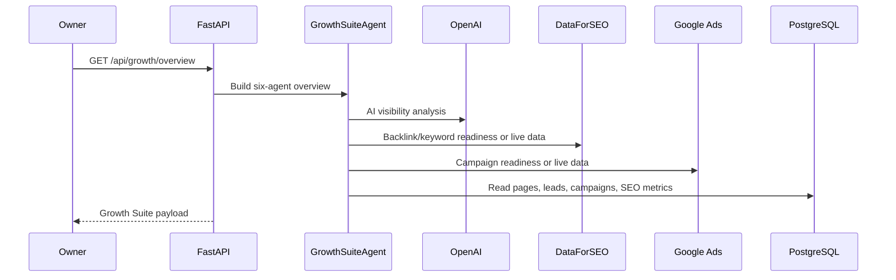

# Architecture Deep Dive

This document explains how the Marketing Agent system is structured from browser to backend, database, cloud hosting, and external platforms.

## High-Level Architecture

## Application Layers

Frontend:

- location: `app/static/`;
- files: `index.html`, `app.js`, `styles.css`, logo assets;
- renders the dashboard routes;
- calls backend APIs;
- renders the public admin experience.

Public landing page frontend:

- generated by backend route `/p/{slug}`;
- includes SEO metadata;
- includes GA4 browser tracking when measurement ID is configured;
- records first-party events through `/api/events`;
- submits leads through `/api/leads`.

Backend API:

- framework: FastAPI;
- main entry: `app/main.py`;
- route definitions: `app/api/routes.py`;
- database session: `app/core/database.py`;
- settings: `app/core/config.py`;
- model definitions: `app/models/entities.py`;
- request/response schemas: `app/models/schemas.py`.

Agent layer:

- core agents live in `app/agents/`;
- integrations live in `app/integrations/`;
- agents read and write through SQLAlchemy sessions.

Database:

- production target: PostgreSQL;
- local fallback: SQLite;
- tables are auto-created at app startup through `Base.metadata.create_all`.

Deployment:

- runtime: one Docker image with web and worker modes;
- AWS services: CloudFront, shared ALB, ECS, EventBridge Scheduler, SQS/DLQ, RDS, S3, and SSM;
- isolation: application-specific services, roles, target group, queue, secrets, database/role, and storage namespace;
- region: `ap-south-1`.

## Request Flow: Dashboard

## Request Flow: Public Landing Page

## Request Flow: SEO Sync

## Request Flow: Growth Suite

## Important Backend Endpoints

Read routes:

- `GET /health`
- `GET /api/dashboard`
- `GET /api/businesses`
- `GET /api/campaigns`
- `GET /api/pages`
- `GET /api/leads`
- `GET /api/recommendations`
- `GET /api/seo/overview`
- `GET /api/seo/integrations`
- `GET /api/growth/overview`
- `GET /api/audit`
- `GET /p/{slug}`
- `GET /robots.txt`
- `GET /sitemap.xml`

Write routes:

- `POST /api/businesses`
- `POST /api/campaigns`
- `POST /api/runs`
- `POST /api/leads`
- `POST /api/events`
- `POST /api/campaigns/{campaign_id}/refresh`
- `POST /api/seo/sync`
- `POST /api/growth/sync`

Admin write routes use `x-api-key` when `API_KEY` is configured.

## Cloud Hosting Reality

The production app is hosted on AWS, not Google servers.

Google is used for:

- search analytics;
- website traffic analytics;
- OAuth;
- Google Ads API;
- Search Console ownership;
- GA4 reporting.

AWS is used for:

- web hosting;
- runtime compute;
- environment variables;
- database/networking;
- deployment;
- infrastructure operations.
