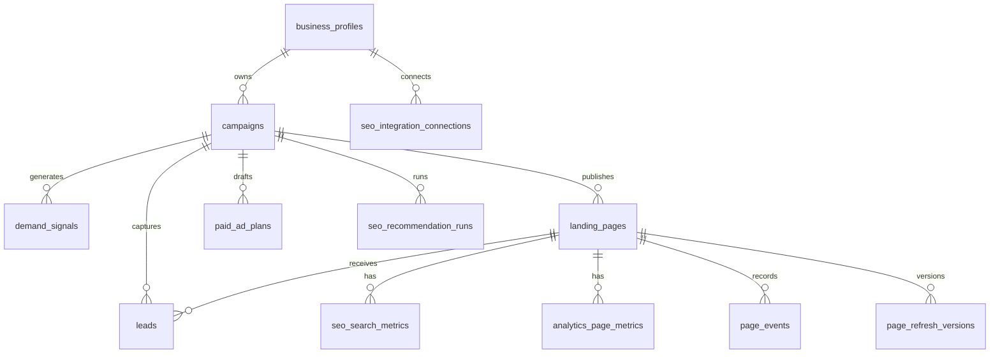

# Database Tables And Queries

This document explains the production database tables, what each one stores, and useful owner queries.

## Database Engine

Production should use PostgreSQL through:

```text
DATABASE_URL
```

Local development can use SQLite:

```text
sqlite:///./data/marketing_agent.db
```

Tables are defined in:

```text
app/models/entities.py
```

## Entity Relationship Overview



## Core Tables

### `business_profiles`

Stores each client/company profile.

Important columns:

- `id`;
- `name`;
- `website`;
- `industry`;
- `audience`;
- `value_proposition`;
- `offers`;
- `competitors`;
- `tone`;
- `created_at`;
- `updated_at`.

Owner query:

```sql
select id, name, website, industry, created_at
from business_profiles
order by created_at desc;
```

### `campaigns`

Stores marketing campaigns linked to a business.

Important columns:

- `id`;
- `business_id`;
- `name`;
- `goal`;
- `target_region`;
- `status`;
- `created_at`.

Owner query:

```sql
select c.id, b.name as business, c.name as campaign, c.target_region, c.status, c.created_at
from campaigns c
join business_profiles b on b.id = c.business_id
order by c.created_at desc;
```

### `demand_signals`

Stores Research Agent keyword/topic output.

Important columns:

- `campaign_id`;
- `keyword`;
- `intent`;
- `region`;
- `priority_score`;
- `rationale`.

Owner query:

```sql
select c.name as campaign, d.keyword, d.intent, d.region, d.priority_score
from demand_signals d
join campaigns c on c.id = d.campaign_id
order by d.priority_score desc, d.created_at desc;
```

### `landing_pages`

Stores generated landing pages.

Important columns:

- `campaign_id`;
- `slug`;
- `title`;
- `hero`;
- `sections`;
- `cta`;
- `seo`;
- `status`;
- `visits`;
- `conversions`.

Owner query:

```sql
select b.name as business, c.name as campaign, p.slug, p.title, p.status, p.visits, p.conversions
from landing_pages p
join campaigns c on c.id = p.campaign_id
join business_profiles b on b.id = c.business_id
order by p.created_at desc;
```

Public URL query:

```sql
select concat('https://agenticgrowthlabs.com/p/', slug) as public_url, title, status
from landing_pages
order by created_at desc;
```

### `leads`

Stores captured leads.

Important columns:

- `campaign_id`;
- `page_id`;
- `name`;
- `email`;
- `company`;
- `message`;
- `score`;
- `status`;
- `source`.

Owner query:

```sql
select l.created_at, b.name as business, p.slug, l.name, l.email, l.company, l.score, l.status
from leads l
join campaigns c on c.id = l.campaign_id
join business_profiles b on b.id = c.business_id
left join landing_pages p on p.id = l.page_id
order by l.created_at desc;
```

### `refresh_recommendations`

Stores Analytics/Refresh Agent recommendations.

Important columns:

- `campaign_id`;
- `page_id`;
- `severity`;
- `recommendation`;
- `expected_impact`;
- `status`.

Owner query:

```sql
select r.created_at, b.name as business, p.title, r.severity, r.status, r.recommendation
from refresh_recommendations r
join campaigns c on c.id = r.campaign_id
join business_profiles b on b.id = c.business_id
left join landing_pages p on p.id = r.page_id
order by r.created_at desc;
```

### `paid_ad_plans`

Stores Paid Campaign Agent drafts, Google validation responses, Google push responses, and Google Ads resource names.

Important columns:

- `business_id`;
- `campaign_id`;
- `name`;
- `objective`;
- `target_region`;
- `daily_budget_micros`;
- `status`;
- `approval_status`;
- `google_campaign_resource_name`;
- `google_budget_resource_name`;
- `google_ad_group_resource_name`;
- `plan`;
- `validation_response`;
- `push_response`.

Status values:

```text
draft
validated
validation_failed
pushed_to_google
push_failed
```

Approval values:

```text
needs_review
ready_for_owner_approval
approved
```

Owner query:

```sql
select p.created_at,
       b.name as business,
       c.name as source_campaign,
       p.name as google_ads_plan,
       p.status,
       p.approval_status,
       round((p.daily_budget_micros / 1000000.0)::numeric, 2) as daily_budget,
       p.google_campaign_resource_name
from paid_ad_plans p
left join business_profiles b on b.id = p.business_id
left join campaigns c on c.id = p.campaign_id
order by p.created_at desc;
```

Audit query for paid campaign actions:

```sql
select created_at, actor, action, entity_id, event_metadata
from audit_events
where entity_type = 'paid_ad_plan'
order by created_at desc;
```

## SEO And Analytics Tables

### `seo_integration_connections`

Tracks Google integration state.

Providers:

- `ga4`;
- `google_search_console`;
- future providers.

Owner query:

```sql
select provider, property_ref, status, last_sync_at, updated_at
from seo_integration_connections
order by updated_at desc;
```

### `seo_search_metrics`

Stores Search Console metrics by page/query/date.

Important columns:

- `page_id`;
- `date`;
- `query`;
- `country`;
- `device`;
- `impressions`;
- `clicks`;
- `ctr`;
- `average_position`;
- `source`.

Owner query:

```sql
select p.slug, m.query, sum(m.impressions) as impressions, sum(m.clicks) as clicks,
       round(avg(m.ctr)::numeric, 4) as avg_ctr,
       round(avg(m.average_position)::numeric, 2) as avg_position
from seo_search_metrics m
join landing_pages p on p.id = m.page_id
group by p.slug, m.query
order by impressions desc;
```

### `analytics_page_metrics`

Stores GA4 and first-party page analytics.

Important columns:

- `page_id`;
- `date`;
- `sessions`;
- `engaged_sessions`;
- `cta_clicks`;
- `form_starts`;
- `form_submits`;
- `scroll_75`;
- `traffic_source`;
- `device`;
- `country`;
- `source`.

Owner query:

```sql
select p.slug, sum(a.sessions) as sessions, sum(a.engaged_sessions) as engaged_sessions,
       sum(a.form_submits) as form_submits, a.source
from analytics_page_metrics a
join landing_pages p on p.id = a.page_id
group by p.slug, a.source
order by sessions desc;
```

### `page_events`

Stores first-party browser events.

Owner query:

```sql
select created_at, path, event_type, referrer
from page_events
order by created_at desc
limit 100;
```

### `page_refresh_versions`

Stores page rewrite/version history.

Owner query:

```sql
select p.slug, v.version_number, v.change_summary, v.created_by, v.created_at
from page_refresh_versions v
join landing_pages p on p.id = v.page_id
order by v.created_at desc;
```

### `seo_recommendation_runs`

Stores SEO/refresh agent run summaries.

Owner query:

```sql
select run_type, pages_scored, recommendations_created, status, source, created_at
from seo_recommendation_runs
order by created_at desc;
```

### `keyword_rank_snapshots`

Stores keyword rank observations.

Owner query:

```sql
select keyword, region, rank_position, search_engine, source, captured_at
from keyword_rank_snapshots
order by captured_at desc;
```

### `sitemap_submissions`

Tracks sitemap submission attempts.

Owner query:

```sql
select sitemap_url, provider, status, response, submitted_at
from sitemap_submissions
order by submitted_at desc;
```

## Governance Tables

### `audit_events`

Stores operational audit history.

Important columns:

- `actor`;
- `action`;
- `entity_type`;
- `entity_id`;
- `event_metadata`;
- `created_at`.

Owner query:

```sql
select created_at, actor, action, entity_type, entity_id, event_metadata
from audit_events
order by created_at desc
limit 100;
```

### `growth_agent_executions`

Stores persisted Growth Suite sync runs.

Important columns:

- `agent_key`;
- `business_id`;
- `campaign_id`;
- `status`;
- `mode`;
- `summary`;
- `metrics`;
- `recommendations`;
- `artifacts`;
- `created_at`.

Owner query:

```sql
select created_at, agent_key, status, mode, summary
from growth_agent_executions
order by created_at desc;
```

Latest agent metrics query:

```sql
select distinct on (agent_key)
       agent_key, status, mode, metrics, recommendations, created_at
from growth_agent_executions
order by agent_key, created_at desc;
```

## Client-Specific Reporting Query

Use this to see one client’s complete page performance.

```sql
select b.name as business,
       p.slug,
       p.title,
       p.status,
       coalesce(sum(sm.impressions), 0) as google_impressions,
       coalesce(sum(sm.clicks), 0) as google_clicks,
       coalesce(round(avg(sm.average_position)::numeric, 2), 0) as avg_position,
       coalesce(sum(am.sessions), 0) as ga4_sessions,
       count(distinct l.id) as leads
from business_profiles b
join campaigns c on c.business_id = b.id
join landing_pages p on p.campaign_id = c.id
left join seo_search_metrics sm on sm.page_id = p.id
left join analytics_page_metrics am on am.page_id = p.id
left join leads l on l.page_id = p.id
where b.name ilike '%Kairoz%'
group by b.name, p.slug, p.title, p.status
order by google_impressions desc, ga4_sessions desc, leads desc;
```
