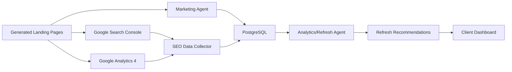

# SEO and Analytics/Refresh Agent Guide

This document explains how the SEO and Analytics/Refresh Agent works in the Marketing Agent system, how to explain it to clients, and what should be added to productionize it.

## Executive Summary

The Analytics/Refresh Agent is the feedback-loop agent in the Marketing Agent platform.

It helps answer:

```text
Which landing pages are working?
Which pages need more traffic before we judge them?
Which pages are getting traffic but not converting?
Which winning pages should be expanded into more SEO pages?
```

The overall growth loop is:

```text
Research demand -> Create SEO landing pages -> Capture leads -> Measure performance -> Refresh pages -> Improve results
```

## Where SEO Fits in the Current System

SEO is not handled by one isolated component. It is distributed across three agents:

| Agent | SEO Role |
| --- | --- |
| Research Agent | Finds demand signals, buyer-intent keywords, and campaign topics. |
| Content/Page Creation Agent | Turns demand signals into landing pages with title, hero copy, page sections, CTA, and SEO metadata. |
| Analytics/Refresh Agent | Reviews page visits and conversions, then recommends whether to wait, rewrite, or scale. |

## Current Implementation

Current Analytics/Refresh Agent file:

```text
app/agents/analytics_refresh.py
```

Current data used:

```text
landing_pages.visits
landing_pages.conversions
landing_pages.title
landing_pages.status
```

The current agent calculates:

```text
conversion_rate = page.conversions / page.visits
```

Then it creates one of three recommendation types.

### Recommendation Rule 1: Not Enough Traffic

Condition:

```text
visits < 25
```

Recommendation:

```text
Send more qualified traffic before making major copy changes.
```

Why this matters:

```text
A page with very few visits does not have enough data for a reliable conversion decision.
```

Example:

```text
Visits: 10
Leads: 1
Conversion rate: 10%
Recommendation: Wait and send more traffic before changing the page.
```

### Recommendation Rule 2: Low Conversion

Condition:

```text
visits >= 25
conversion_rate < 3%
```

Recommendation:

```text
Rewrite the hero and CTA around a stronger buyer pain.
```

Why this matters:

```text
The page has enough traffic, but visitors are not converting into leads.
```

Example:

```text
Visits: 100
Leads: 2
Conversion rate: 2%
Recommendation: Improve the offer, hero copy, and CTA.
```

### Recommendation Rule 3: Scale a Working Page

Condition:

```text
visits >= 25
conversion_rate >= 3%
```

Recommendation:

```text
Create a variant for the strongest converting segment.
```

Why this matters:

```text
The page is producing leads, so the system should help scale the winning pattern.
```

Example:

```text
Visits: 200
Leads: 14
Conversion rate: 7%
Recommendation: Create similar pages for related keywords, regions, or buyer segments.
```

## How to Explain This to a Client

Use this simple explanation:

```text
The system does not just generate landing pages once and stop.
It watches how each page performs, checks whether visitors become leads, and then recommends the next best action.
Weak pages get improvement recommendations.
Pages without enough traffic are left alone until the data is reliable.
Strong pages are used as patterns for new content and campaign expansion.
```

Client-friendly example:

```text
Suppose we create 20 SEO landing pages for your services.
After publishing, the Analytics/Refresh Agent monitors each page.
If a page is ranking but users are not clicking, we improve the title and meta description.
If users click but do not submit the form, we improve the landing page offer, hero copy, and CTA.
If a page converts well, we create more pages for similar keywords, industries, locations, or buyer segments.
```

## What SEO Means in This Product

For this system, SEO means more than writing keyword pages.

It includes:

```text
Demand discovery
Search-intent mapping
Landing page creation
Technical discoverability
Lead conversion measurement
Content refresh recommendations
Continuous improvement
```

The business outcome is:

```text
More qualified search traffic and more qualified leads from targeted landing pages.
```

## Current Capabilities

The current system can:

- Generate demand signals.
- Generate SEO landing pages from those signals.
- Store SEO metadata such as description and keywords.
- Publish public landing pages.
- Count visits when pages are opened.
- Count conversions when forms are submitted.
- Calculate dashboard conversion rate.
- Generate refresh recommendations.
- Store recommendations in PostgreSQL.
- Store audit events for governance.

## Current Limitations

The current system does not yet connect to external SEO platforms.

It does not yet collect:

- Google Search impressions.
- Google Search clicks.
- Google Search CTR.
- Average ranking position.
- Search queries bringing traffic.
- Indexed status.
- Sitemap submission status.
- GA4 sessions and engagement metrics.
- Scroll depth.
- Form-start events.
- CTA-click events.

This means the current Analytics/Refresh Agent is based on first-party app data, not full search-engine performance data.

## Production SEO Architecture

A production-grade version should add external SEO and analytics integrations.



## Recommended Production Integrations

### 1. Google Search Console

Purpose:

```text
Understand how pages perform in Google Search.
```

Data to collect:

| Metric | Why It Matters |
| --- | --- |
| Impressions | Whether Google is showing the page. |
| Clicks | Whether users choose the page from search results. |
| CTR | Whether title/meta description are compelling. |
| Average position | Whether the page is ranking high enough. |
| Query | Which searches are triggering the page. |
| Page URL | Which landing page is receiving search visibility. |
| Country | Which regions are responding. |
| Device | Whether mobile/desktop behavior differs. |

Useful client interpretation:

```text
High impressions + low CTR = improve title and meta description.
Low impressions = improve content relevance, indexing, internal links, or keyword targeting.
Good clicks + poor leads = improve landing page conversion.
Unexpected queries = create new pages for emerging demand.
```

Reference:

```text
https://developers.google.com/webmaster-tools
```

### 2. Google Analytics 4

Purpose:

```text
Understand user behavior after landing on a page.
```

Data to collect:

| Metric/Event | Why It Matters |
| --- | --- |
| Sessions | Page traffic volume. |
| Engaged sessions | Whether users are meaningfully interacting. |
| CTA clicks | Whether users respond to the offer. |
| Form starts | Whether users begin the lead journey. |
| Form submits | Whether users complete conversion. |
| Traffic source | Which channels are driving traffic. |
| Device | Whether mobile UX is affecting conversion. |

Useful client interpretation:

```text
High visits + low engagement = opening message is weak.
High CTA clicks + low form submits = form is too long or trust is low.
Mobile performance weaker than desktop = improve mobile layout and page speed.
```

Reference:

```text
https://developers.google.com/analytics/devguides/reporting/data/v1
```

### 3. Sitemap and Indexing Automation

Production should generate:

```text
/sitemap.xml
/robots.txt
canonical URLs
```

The system should submit or refresh sitemaps through Search Console when new pages are published.

### 4. Structured Data

Production pages should include JSON-LD structured data where relevant:

```text
Organization
Service
FAQPage
BreadcrumbList
LocalBusiness, if location-based
```

Structured data helps search engines better understand the content and may support richer search appearances.

Reference:

```text
https://developers.google.com/search/docs/appearance/structured-data/intro-structured-data
```

### 5. SEO Health Score

Each landing page should receive an SEO health score.

Example scoring model:

| Area | Weight |
| --- | ---: |
| Technical SEO | 25% |
| Content relevance | 25% |
| Search performance | 25% |
| Conversion performance | 25% |

Example:

```text
Page: AI marketing automation for SaaS
Technical SEO: 90
Content relevance: 82
Search performance: 60
Conversion performance: 35
Overall score: 67

Recommendation:
Traffic is coming, but the page is not converting.
Improve the offer clarity, hero copy, CTA, and proof points.
```

## Production Refresh Decision Matrix

| Signal | Diagnosis | Recommended Action |
| --- | --- | --- |
| Low impressions | Page is not being discovered or indexed well. | Improve keyword targeting, internal links, sitemap, and page depth. |
| High impressions + low CTR | Search result is not attractive enough. | Improve title, meta description, and schema. |
| High clicks + low engagement | Page message does not match search intent. | Rewrite hero and first section. |
| High form starts + low submits | Lead form has friction. | Shorten form, add trust copy, improve validation. |
| High conversion rate | Page is working. | Create variants by keyword, geography, persona, or industry. |
| High ranking + low conversion | Search visibility is good but offer is weak. | Improve CTA, offer, proof, and lead magnet. |
| Queries outside target audience | Traffic is misaligned. | Tighten content and metadata around the ideal buyer. |

## Production Data Model Additions

Recommended new tables:

```text
seo_search_metrics
analytics_page_metrics
page_refresh_versions
seo_recommendation_runs
keyword_rank_snapshots
sitemap_submissions
```

Suggested `seo_search_metrics` fields:

```text
id
page_id
date
query
country
device
impressions
clicks
ctr
average_position
created_at
```

Suggested `analytics_page_metrics` fields:

```text
id
page_id
date
sessions
engaged_sessions
cta_clicks
form_starts
form_submits
traffic_source
device
country
created_at
```

Suggested `page_refresh_versions` fields:

```text
id
page_id
version_number
change_summary
old_title
new_title
old_hero
new_hero
old_cta
new_cta
created_by
created_at
```

## Production Operating Rhythm

Recommended cadence:

### Daily

- Pull Search Console metrics.
- Pull GA4 metrics.
- Update page-level analytics tables.
- Check for broken pages or zero-data anomalies.

### Weekly

- Run Analytics/Refresh Agent.
- Score every active landing page.
- Generate client-facing recommendations.
- Prioritize pages by impact.

### Monthly

- Compare before/after refresh performance.
- Expand winning pages into new campaigns.
- Archive or rewrite poor performers.
- Export client SEO performance report.

## Client-Facing Dashboard Metrics

Production dashboard should show:

```text
Pages published
Indexed pages
Organic impressions
Organic clicks
CTR
Average position
Visits
Leads
Conversion rate
Top converting pages
Pages needing refresh
Recommended new page opportunities
Before/after uplift
```

## Client Talk Track

Use this explanation in meetings:

```text
The Marketing Agent creates SEO landing pages from buyer-intent demand signals.
But the real value is the refresh loop.
Once pages are live, the system monitors search visibility, clicks, visits, and lead conversions.
It then recommends whether to improve discovery, improve click-through rate, improve landing-page conversion, or scale a winning page into more content.
That turns SEO from a one-time content exercise into a continuous demand-generation engine.
```

Short version:

```text
This is not just an AI content generator.
It is a self-improving SEO and lead-generation workflow.
```

## Productionization Checklist

- Add Google Search Console OAuth/service-account integration.
- Add GA4 Data API integration.
- Add scheduled background jobs for daily metric sync.
- Add `sitemap.xml` generation.
- Add `robots.txt`.
- Add canonical tags.
- Add JSON-LD structured data.
- Add SEO metric tables.
- Add page refresh version history.
- Add A/B test support.
- Add dashboard filters by campaign, page, date range, query, country, and device.
- Add recommendation severity and owner workflow.
- Add before/after performance tracking.
- Add CloudWatch alarms for failed metric syncs.
- Add audit events for recommendation generation and applied refreshes.

## Final Positioning

The best positioning for clients:

```text
An AI-powered demand generation engine that uses SEO landing pages, lead capture, and analytics-driven refresh recommendations to continuously improve inbound pipeline.
```

The outcome clients care about:

```text
More qualified traffic.
More qualified leads.
Better conversion.
Less manual marketing effort.
Clear visibility into what is working.
```
